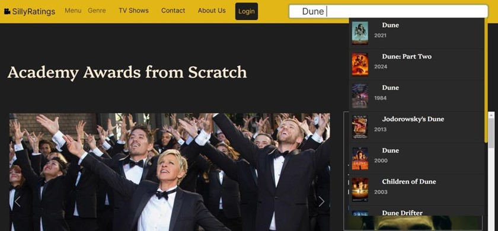

# SillyRatings

SillyRatings is a web project that aims to create a dynamic and user-friendly movie review website where users can explore, review, and discuss their favorite movies. The website offers a vast database of movies spanning various genres, ratings, and release years.

## Features

- User registration using email or social media accounts
- Movie search and review using **OMDb API**
- Latest Hollywood news using **News API**
- Best moments of Oscars
- Best movies of various genres
- Top-rated TV shows in sitcom and drama categories
- Contact Us and About Us pages

## Installation

1. Clone the repository:
$git clone https://github.com/SarthakRay26/Movie_Review-oMDb-.git

2. Open the project folder in your preferred code editor.

3. Set up the necessary API keys:
- Obtain an API key from OMDb API (https://www.omdbapi.com/) and replace `<OMDB_API_KEY>` in `script.js` with your API key.
- Obtain an API key from NewsApi (https://newsapi.org/) and replace `<NEWS_API_KEY>` in `register.js` with your API key.

4. Open the project in a web browser:
- If you have a local server environment set up, you can run the project locally.
- Alternatively, you can host the project on a web server to make it accessible online.

## Screenshots
## Landing Page

*This is our landing page (Home Page for the website)*

## Movie Search

*This is when the user searches for any movie*

*This is the search result*

*On the left we get to see the photos from different Oscars and on the right we see the latest news on movies across the world*

*This is further down the home page, clips from movies and tv shows*

## Genre Search

*This is where you can search for your favourite genre*

*When you click your genre*

## Movie Details
  
*When you click any movie here (The size of the page is reduced for better showing)*

## TV Shows
  
*When you click on TV Shows*

  
*When you click on Drama*

  
*When you click on Sitcom*

    
*When you click any of the TV Show*

## Navigation and Contact
  
*Menu from the Navbar*

  
*Contact Us page*

  
*Contact Us page (alternative view)*

## User Authentication
  
*Sign Up Page*

   
*Sign In Page*

## Links

- [Google Drive Link](https://drive.google.com/drive/folders/1exx0U8IRdV_CBCrc_VPXLOAUcNmi1P0p?usp=sharing)

## Contributors

-// Sarthak Ray 
-// Rakshit Bansal 
